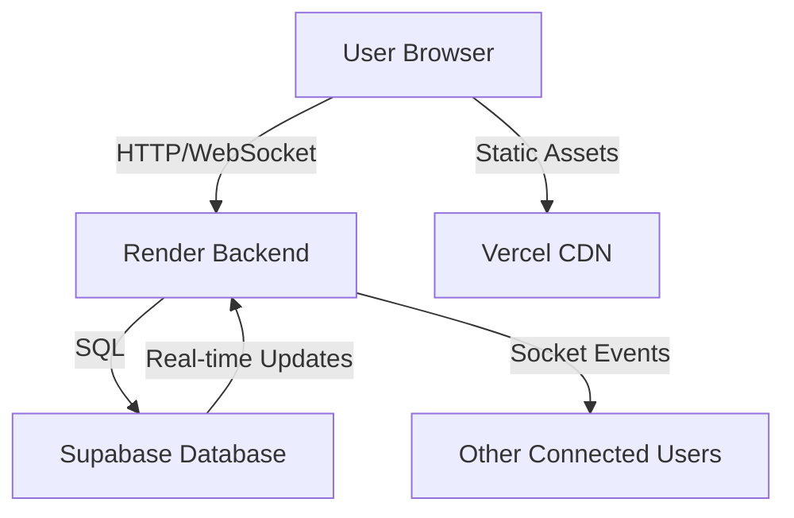

# 📁 TUIZ Project Structure

Comprehensive overview of the TUIZ project organization and sub-repositories.

## 🏗️ Root Structure

```
/TUIZ                           ← Main project repository
├── README.md                   ← Main project documentation
├── DEPLOYMENT.md               ← Deployment guide
├── setup.sh                    ← Unix setup script
├── setup.bat                   ← Windows setup script
├── .gitignore                  ← Global Git ignore rules
├── start-network-test.bat      ← Network testing script
├── docs/                       ← Project documentation
│   ├── copilot_quiz_app_prompt.md
│   ├── changes_required.md
│   ├── feature_req.md
│   └── plan.md
├── frontend/                   ← Frontend sub-repository
├── backend/                    ← Backend sub-repository
└── database/                   ← Database sub-repository
```

## 🎨 Frontend Sub-Repository (`/frontend`)

React + Vite application for the user interface.

```
frontend/
├── README.md                   ← Frontend documentation
├── package.json                ← Dependencies and scripts
├── vite.config.js              ← Vite configuration
├── eslint.config.js            ← ESLint configuration
├── index.html                  ← Main HTML template
├── vercel.json                 ← Vercel deployment config
├── .env.example                ← Environment variables template
├── .env.local                  ← Local environment variables (create from example)
├── public/                     ← Static assets
│   └── vite.svg
└── src/                        ← Source code
    ├── App.jsx                 ← Main application component
    ├── App.css                 ← Global styles
    ├── main.jsx                ← React entry point
    ├── socket.js               ← Socket.IO client setup
    ├── assets/                 ← Images, sounds, icons
    ├── components/             ← Reusable UI components
    │   ├── IntermediateScoreboard.jsx
    │   ├── MetadataForm.jsx
    │   ├── QuestionBuilder.jsx
    │   ├── QuestionListPanel.jsx
    │   ├── QuestionReorderModal.jsx
    │   ├── QuestionsForm.jsx
    │   ├── SettingsForm.jsx
    │   └── *.css               ← Component-specific styles
    ├── contexts/               ← React Context providers
    │   └── AuthContext.jsx
    ├── pages/                  ← Main application pages
    │   ├── CreateQuiz.jsx
    │   ├── Dashboard.jsx
    │   ├── Home.jsx
    │   ├── Host.jsx
    │   ├── HostLobby.jsx
    │   ├── Join.jsx
    │   ├── Login.jsx
    │   ├── Quiz.jsx
    │   ├── QuizControl.jsx
    │   ├── Register.jsx
    │   ├── Scoreboard.jsx
    │   ├── WaitingRoom.jsx
    │   └── *.css               ← Page-specific styles
    ├── hooks/                  ← Custom React hooks
    │   ├── useSocket.js
    │   ├── useAudio.js
    │   └── useGame.js
    ├── utils/                  ← Utility functions
    │   ├── animations.js
    │   ├── audio.js
    │   ├── gameUtils.js
    │   └── socketEvents.js
    └── styles/                 ← Global stylesheets
        ├── globals.css
        ├── variables.css
        └── animations.css
```

### Key Features
- 📱 Mobile-first responsive design
- 🎬 Framer Motion animations
- 🔊 Howler.js sound effects
- ⚡ Real-time Socket.IO communication
- 🎮 Game-like UI with vibrant design

## ⚡ Backend Sub-Repository (`/backend`)

Node.js + Express + Socket.IO server for real-time communication.

```
backend/
├── README.md                   ← Backend documentation
├── package.json                ← Dependencies and scripts
├── server.js                   ← Main server entry point
├── render.yaml                 ← Render deployment config
├── .env.example                ← Environment variables template
├── .env                        ← Local environment variables (create from example)
├── config/                     ← Configuration files
│   ├── database.js             ← Database connection setup
│   ├── gameConfig.js           ← Game-specific configurations
│   └── supabase.js             ← Supabase client setup
├── controllers/                ← Route controllers
│   ├── authController.js
│   ├── gameController.js
│   ├── quizController.js
│   └── userController.js
├── middleware/                 ← Express middleware
│   ├── auth.js                 ← Authentication middleware
│   ├── validation.js           ← Request validation
│   ├── rateLimiter.js          ← Rate limiting
│   └── errorHandler.js         ← Error handling
├── models/                     ← Database models/schemas
│   ├── User.js
│   ├── Quiz.js
│   ├── Question.js
│   ├── GameSession.js
│   └── PlayerAnswer.js
├── routes/                     ← Express routes
│   ├── auth.js
│   ├── games.js
│   ├── quizzes.js
│   └── users.js
├── services/                   ← Business logic services
│   ├── authService.js
│   ├── gameService.js
│   ├── quizService.js
│   └── socketService.js
├── socket/                     ← Socket.IO event handlers
│   ├── gameEvents.js
│   ├── roomEvents.js
│   ├── playerEvents.js
│   └── adminEvents.js
├── utils/                      ← Utility functions
│   ├── RoomManager.js          ← Game room management
│   ├── ScoreCalculator.js
│   ├── RoomCodeGenerator.js
│   └── logger.js
├── tests/                      ← Test files
│   ├── unit/
│   ├── integration/
│   └── e2e/
└── logs/                       ← Log files
```

### Key Features
- 🔌 Socket.IO real-time communication
- 🏠 Efficient room management for 200-300 players
- 📊 Live scoring and leaderboards
- 🗄️ Supabase PostgreSQL integration
- 🛡️ JWT authentication
- 📈 Scalable architecture

## 🗄️ Database Sub-Repository (`/database`)

Supabase PostgreSQL schema, migrations, and documentation.

```
database/
├── README.md                   ← Database documentation
├── migrations/                 ← SQL migration files
│   ├── 001_create_users_table.sql
│   ├── 002_create_quizzes_table.sql
│   ├── 003_create_questions_table.sql
│   ├── 004_create_game_sessions_table.sql
│   ├── 005_create_game_participants_table.sql
│   ├── 006_create_player_answers_table.sql
│   └── 007_create_leaderboards_table.sql
├── sample-data/                ← Sample data for testing
│   └── sample_data.sql
├── schemas/                    ← Database schema documentation
│   ├── erd.png                 ← Entity Relationship Diagram
│   └── schema.md               ← Detailed schema documentation
└── scripts/                    ← Utility scripts
    ├── backup.sql
    ├── reset.sql
    └── performance_indexes.sql
```

### Database Schema Overview

#### Core Tables
1. **`users`** - User profiles and authentication
2. **`quizzes`** - Quiz templates and metadata
3. **`questions`** - Individual questions within quizzes
4. **`game_sessions`** - Active game instances
5. **`game_participants`** - Players in game sessions
6. **`player_answers`** - Individual answer submissions
7. **`leaderboards`** - Final rankings and scores

#### Key Features
- 🔒 Row Level Security (RLS) policies
- 📊 Real-time subscriptions
- 🚀 Optimized indexes for performance
- 🔄 Automated triggers and functions
- 📈 Scalable design for high concurrency

## 🛠️ Development Workflow

### 1. Initial Setup
```bash
# Clone the repository
git clone <your-repo-url>
cd TUIZ

# Run setup script
# Unix/Mac:
chmod +x setup.sh
./setup.sh

# Windows:
setup.bat
```

### 2. Development Process
```bash
# Start backend (Terminal 1)
cd backend
npm run dev

# Start frontend (Terminal 2)
cd frontend
npm run dev

# Access application
# Frontend: http://localhost:5173
# Backend: http://localhost:3001
```

### 3. Testing
```bash
# Backend tests
cd backend
npm test

# Frontend tests
cd frontend
npm test

# E2E tests
npm run test:e2e
```

### 4. Deployment
Follow the comprehensive [DEPLOYMENT.md](./DEPLOYMENT.md) guide.

## 📊 Technology Stack Summary

| Component | Technology | Purpose |
|-----------|------------|---------|
| **Frontend** | React + Vite | User interface and interactions |
| **Animations** | Framer Motion | Smooth transitions and effects |
| **Audio** | Howler.js | Sound effects and feedback |
| **Backend** | Node.js + Express | API server and business logic |
| **Real-time** | Socket.IO | WebSocket communication |
| **Database** | Supabase (PostgreSQL) | Data persistence and real-time |
| **Authentication** | JWT + Supabase Auth | User management |
| **Styling** | CSS Modules | Component-scoped styling |
| **State Management** | React Context | Global state management |
| **Testing** | Jest + Playwright | Unit and E2E testing |
| **Deployment** | Vercel + Render | Free hosting services |

## 🔄 Data Flow



## 📈 Scalability Considerations

### Current Architecture Supports
- **200-300 concurrent players** per game session
- **Multiple simultaneous games**
- **Real-time updates** with minimal latency
- **Mobile-responsive** gameplay

### Free Tier Limitations
- **Render**: 750 hours/month, sleeps after 15min inactivity
- **Vercel**: 100GB bandwidth, 6000 build minutes
- **Supabase**: 500MB database, 2GB bandwidth

### Upgrade Path
For production scale:
1. **Render Pro** ($7/month) - No sleep, better performance
2. **Vercel Pro** ($20/month) - Higher limits
3. **Supabase Pro** ($25/month) - 8GB database, more bandwidth

## 🤝 Contributing

### Code Organization Principles
1. **Separation of Concerns** - Each sub-repository has a specific role
2. **Modular Architecture** - Easy to understand and maintain
3. **Type Safety** - JSDoc comments and validation
4. **Performance First** - Optimized for real-time interactions
5. **Mobile First** - Responsive design for all devices

### Development Guidelines
- Follow ESLint/Prettier configurations
- Write tests for new features
- Update documentation for significant changes
- Use conventional commit format
- Create PRs for all changes

This structure ensures a maintainable, scalable, and well-documented codebase that can handle the requirements of a real-time multiplayer quiz application.
